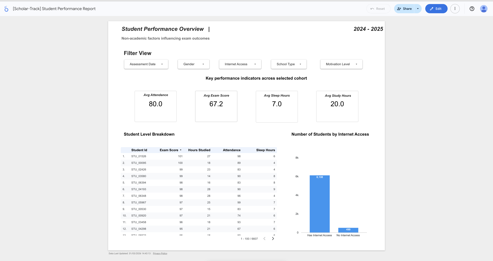

# 🎓 scholar-track  
### End-to-end student performance data pipeline for Data Engineering Zoomcamp

---

## 🎯 The Problem: The "Context Gap" in Education

### The Current Reality
Educational leadership often lacks a unified view of student success. While **academic outcomes** (grades) are tracked, the **contextual drivers**—socio-economic factors, behavioral habits (sleep, internet access), and parental engagement—are typically siloed in disconnected spreadsheets or manual surveys.  

Because these datasets live in different formats and locations, it is difficult to understand how a student's life outside the classroom impacts their academic performance.

### The Problem This Project Solves
This project builds a **centralised data pipeline** that bridges these disconnected sources. By consolidating data into a cloud-native architecture, it removes the need for manual data stitching and establishes a **single source of truth**.

**This enables educational stakeholders to:**
- **Identify Root Causes:** Correlate non-academic factors with performance outcomes  
- **Reduce Manual Work:** Replace spreadsheet-based processes with a structured data warehouse  
- **Scale Efficiently:** Support future data ingestion without rebuilding the system  

---

## 🏗️ Project Architecture

| Phase | Task | Implementation |
|------|------|----------------|
| **Step 1** | Git Setup | `.gitignore` used to protect sensitive credentials |
| **Step 2** | Infrastructure | Terraform provisions GCS bucket and BigQuery dataset |
| **Step 3** | Ingestion | Kestra + Python orchestrate data ingestion into GCS |
| **Step 4** | Data Warehouse Load | Data loaded into BigQuery |
| **Step 5** | Optimisation | Partitioning and clustering applied |
| **Step 6** | Visualisation | Looker Studio connected to BigQuery |

---

## 🗄️ Data Warehouse Design

The warehouse is structured into three layers:

- `student_performance_stage` — staging table for cleaned ingestion data  
- `student_performance` — final partitioned and clustered analytical table (**source of truth**)  
- `student_performance_monthly` — aggregated reporting table  

### Partitioning Strategy
The `student_performance` table is partitioned by `assessment_date`.  
This ensures that time-based queries only scan relevant partitions, improving performance and reducing cost.

### Clustering Strategy
The table is clustered by:
- `School_Type`
- `Internet_Access`

These fields are commonly used in filtering and aggregation. Clustering improves query efficiency by reducing the amount of data scanned.

---

## 🔄 Transformations

Transformations are implemented using BigQuery SQL.

The pipeline follows a structured flow:
- Raw ingestion → `student_performance_stage`  
- Staging → `student_performance` (final analytical table)  

A monthly aggregated table (`student_performance_monthly`) is also created to support future reporting and optimisation use cases, although it is not the primary focus of the current pipeline.

All transformations are explicitly defined using selected columns (**no `SELECT *`**) to ensure schema control and clarity.

---

## 📊 Dashboard

The dashboard is built using Looker Studio and connected to BigQuery.

🔗 **Dashboard Link:**  
https://lookerstudio.google.com/reporting/bc11745a-5f2b-4a03-aaa2-7074c09f533a  

### Dashboard Preview


### Key Insights
- Monthly average exam score trends  
- Comparison of student performance based on internet access  

This enables quick identification of patterns and key drivers behind student performance.

---

## 🔁 Reproducibility

This project is fully reproducible in a cloud environment.  
Sensitive credentials (e.g. service account keys) are intentionally excluded for security reasons and must be configured locally.

### Prerequisites
- Google Cloud account  
- gcloud CLI installed  
- Terraform installed  
- Docker installed (for Kestra)  

---

## ⚙️ Setup Instructions

### 1. Clone the repository
```bash
git clone https://github.com/YOUR_USERNAME/scholar-track.git
cd scholar-track
```

### 2. Authenticate with Google Cloud
```bash
gcloud auth application-default login
```

### 3. Provision infrastructure using Terraform
```bash
cd terraform
terraform init
terraform apply
```

### 4. Run the Kestra pipeline
- Start Kestra using Docker  
- Execute the ETL workflow located in `flows/` to ingest data into GCS and BigQuery  

### 5. Execute data warehouse transformations
Run the SQL scripts located in the `scripts/` directory in BigQuery to create the warehouse tables.

### 6. View results
- Query tables in BigQuery  
- Access the Looker Studio dashboard via the link above  

---

## 📝 Notes on Design

> **Note on Automation:**  
While the pipeline is currently triggered manually, it is designed for future automation, enabling integration with live School Management Systems (SMS).

The `student_performance_monthly` table supports future incremental updates and reporting efficiency.  
In this project, a static CSV dataset was used, so incremental updates were not required.