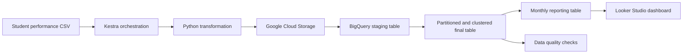
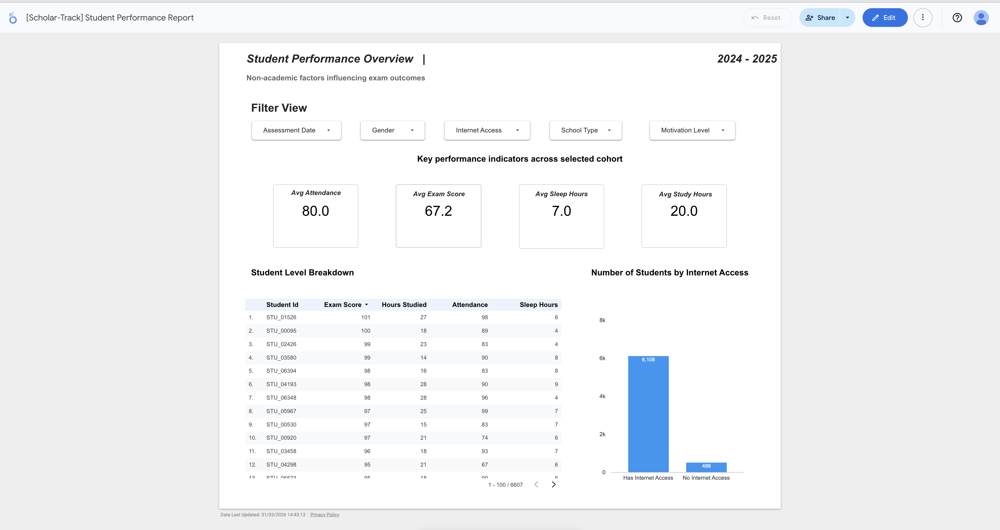

# 🎓 Scholar Track
### End-to-end student performance data pipeline for Data Engineering Zoomcamp 2026

---

## 🎯 The Problem: The "Context Gap" in Education

### The Current Reality

Educational leadership often lacks a unified view of student success. While **academic outcomes** such as grades are tracked, the **contextual drivers**—socio-economic factors, behavioural habits, internet access, sleep, and parental engagement—are often stored separately.

Because these datasets live in different formats and locations, it can be difficult to understand how a student's life outside the classroom affects academic performance.

### The Problem This Project Solves

Scholar Track builds a centralised data pipeline that brings these factors together in a cloud data warehouse and creates a single source of truth for analysis.

This enables educational stakeholders to:

- **Identify root causes:** compare non-academic factors with performance outcomes
- **Reduce manual work:** replace manual spreadsheet processing with a structured pipeline
- **Support future growth:** provide a foundation for additional student data sources

---

## 🏗️ Project Architecture


```mermaid
flowchart LR
    A[Student performance CSV] --> B[Kestra orchestration]
    B --> C[Python transformation]
    C --> D[Google Cloud Storage]
    D --> E[BigQuery staging table]
    E --> F[Partitioned and clustered final table]
    F --> G[Monthly reporting table]
    F --> H[Data quality checks]
    G --> I[Looker Studio dashboard]
```

| Phase | Task | Implementation |
|---|---|---|
| **Step 1** | Infrastructure | Terraform provisions the GCS bucket and BigQuery dataset |
| **Step 2** | Ingestion | Kestra downloads the source CSV |
| **Step 3** | Transformation | Python adds student IDs and assessment date fields |
| **Step 4** | Data lake | The transformed CSV is stored in GCS |
| **Step 5** | Data warehouse | Kestra loads staging, final, and reporting tables in BigQuery |
| **Step 6** | Validation | The pipeline checks that tables are populated and row counts match |
| **Step 7** | Visualisation | Looker Studio connects to BigQuery |

---

## 🗄️ Data Warehouse Design

The warehouse is structured into three layers:

- `student_performance_stage` — repeatable staging load from GCS
- `student_performance` — final partitioned and clustered analytical table and source of truth
- `student_performance_monthly` — aggregated reporting table

### Partitioning Strategy

The `student_performance` table is partitioned by `assessment_date`. This ensures that date-based queries only scan the relevant partitions, improving performance and controlling query costs.

### Clustering Strategy

The table is clustered by:

- `School_Type`
- `Internet_Access`

These fields support common comparisons and filters in the analysis.

---

## 🔄 Transformations

The pipeline:

1. Downloads the source CSV.
2. Checks that the source is not empty.
3. Adds a unique `student_id`.
4. Adds synthetic assessment dates across an academic year because the source dataset does not include dates.
5. Derives `assessment_year` and `assessment_month`.
6. Uploads the transformed file to GCS.
7. Loads BigQuery and creates the final reporting tables.

The final SQL uses explicitly selected columns rather than `SELECT *` so the expected schema remains clear.

---

## 📊 Dashboard

The dashboard was built using Looker Studio and connected to BigQuery.

🔗 **Dashboard:** https://lookerstudio.google.com/reporting/bc11745a-5f2b-4a03-aaa2-7074c09f533a



### Key Insights

- Monthly average exam-score trends
- Student performance comparisons based on internet access
- Comparisons by school type

The published dashboard shows the results from the original project environment. Someone reproducing the project in a different GCP account can connect Looker Studio to their newly created BigQuery tables.

---

## 🔁 Reproducibility: How to Run the Project

The instructions below allow another person to run the pipeline using their own Google Cloud project. Credentials and personal cloud settings are not stored in GitHub.

### Prerequisites

- Git
- Docker with Docker Compose v2
- Google Cloud account with billing enabled
- Google Cloud CLI (`gcloud` and `bq`)
- Terraform 1.5 or later
- Permission to create GCS, BigQuery, service-account, and IAM resources

### 1. Clone the repository

```bash
git clone https://github.com/ahmedrsal05/scholar-track.git
cd scholar-track
```

### 2. Sign in to Google Cloud

```bash
gcloud auth login
gcloud auth application-default login
gcloud config set project YOUR_PROJECT_ID
```

### 3. Add your configuration

```bash
cp .env.example .env
cp infrastructure/terraform/terraform.tfvars.example infrastructure/terraform/terraform.tfvars
```

Edit both files with the same project, bucket, dataset, and location values. The GCS bucket name must be globally unique.

Example `.env`:

```dotenv
GCP_PROJECT_ID=your-gcp-project-id
GCP_BUCKET_NAME=your-unique-scholar-track-bucket
GCP_DATASET=scholartrack_warehouse
GCP_LOCATION=US
```

The real `.env`, Terraform variables, state, and credentials are ignored by Git.

### 4. Create GCS and BigQuery with Terraform

```bash
cd infrastructure/terraform
terraform init
terraform fmt -check
terraform validate
terraform plan
terraform apply
cd ../..
```

Terraform creates the required APIs, GCS bucket, and BigQuery dataset.

### 5. Create credentials for Kestra

Load `.env` into your current terminal:

```bash
set -a
source .env
set +a
```

Create the service account and grant only the roles used by the pipeline:

```bash
gcloud iam service-accounts create scholar-track-kestra \
  --display-name="Scholar Track Kestra"

KESTRA_SERVICE_ACCOUNT="scholar-track-kestra@${GCP_PROJECT_ID}.iam.gserviceaccount.com"

gcloud projects add-iam-policy-binding "$GCP_PROJECT_ID" \
  --member="serviceAccount:${KESTRA_SERVICE_ACCOUNT}" \
  --role="roles/storage.objectAdmin"

gcloud projects add-iam-policy-binding "$GCP_PROJECT_ID" \
  --member="serviceAccount:${KESTRA_SERVICE_ACCOUNT}" \
  --role="roles/bigquery.dataEditor"

gcloud projects add-iam-policy-binding "$GCP_PROJECT_ID" \
  --member="serviceAccount:${KESTRA_SERVICE_ACCOUNT}" \
  --role="roles/bigquery.jobUser"

gcloud iam service-accounts keys create service-account.json \
  --iam-account="$KESTRA_SERVICE_ACCOUNT"
```

Encode the credential for Kestra OSS:

```bash
printf 'SECRET_GCP_SERVICE_ACCOUNT=%s\n' \
  "$(base64 < service-account.json | tr -d '\n')" > .env_encoded
```

Do not commit `service-account.json` or `.env_encoded`.

### 6. Start Kestra

```bash
docker compose config --quiet
docker compose up -d
docker compose ps
```

Open http://localhost:8080. The flows in `flows/kestra/` are loaded automatically.

### 7. Run the pipeline

In Kestra:

1. Open **Flows**.
2. Select `zoomcamp.08_student_performance_etl`.
3. Select **Execute**.

The pipeline runs:

```text
CSV download
→ Python transformation
→ GCS upload
→ BigQuery staging load
→ final table
→ monthly table
→ data checks
```

### 8. Confirm that it worked

The Kestra execution should finish with `SUCCESS`. Verify the output with:

```bash
bq query --use_legacy_sql=false \
  "SELECT
     (SELECT COUNT(*) FROM \`${GCP_PROJECT_ID}.${GCP_DATASET}.student_performance_stage\`) AS staging_rows,
     (SELECT COUNT(*) FROM \`${GCP_PROJECT_ID}.${GCP_DATASET}.student_performance\`) AS final_rows,
     (SELECT COUNT(*) FROM \`${GCP_PROJECT_ID}.${GCP_DATASET}.student_performance_monthly\`) AS monthly_rows"
```

Expected result:

```text
staging_rows = 6607
final_rows   = 6607
monthly_rows > 0
```

The pipeline also fails automatically if the final table is empty or if the staging and final row counts do not match.

---

## 🧪 Local Checks

These checks do not require GCP:

```bash
python3 scripts/check_project.py
terraform -chdir=infrastructure/terraform fmt -check
```

After creating `.env` and `.env_encoded`, also run:

```bash
docker compose config --quiet
```

---

## 🛠️ Common Problems

- **`.env_encoded` is missing:** complete step 5 before starting Docker Compose.
- **Bucket name is already used:** choose a more unique bucket name and change it in both local configuration files.
- **Permission denied or `403`:** check the selected GCP project and the three service-account roles.
- **Kestra cannot find a variable:** restart Docker Compose after editing `.env`.
- **BigQuery location error:** use compatible GCS and BigQuery locations; the example uses `US`.
- **First Kestra startup is slow:** Docker may still be downloading the pinned images.

---

## 🧹 Cleanup

Stop the local services:

```bash
docker compose down
```

Remove their local volumes if they are no longer required:

```bash
docker compose down --volumes
```

To delete the GCP resources, set `force_destroy = true` in your local `terraform.tfvars`, review the Terraform plan, and run:

```bash
terraform -chdir=infrastructure/terraform apply
terraform -chdir=infrastructure/terraform destroy
```

Deleting the bucket or dataset also deletes the data stored inside it.

---

## 📝 Notes on Design

> **Note on Automation:**
While the pipeline is currently triggered manually, it is designed for future automation, enabling integration with live School Management Systems (SMS).

The `student_performance_monthly` table supports future incremental updates and reporting efficiency.
In this project, a static CSV dataset was used, so incremental updates were not required.

---

## 📁 Repository Structure

```text
.
├── data/raw/                  # Original source data
├── flows/kestra/              # Kestra flows
├── images/                    # Dashboard preview
├── infrastructure/terraform/ # GCP infrastructure
├── scripts/                   # SQL and local checks
├── .env.example               # Safe configuration example
├── docker-compose.yml         # Local Kestra services
└── README.md
```

## License

See [LICENSE](LICENSE).
